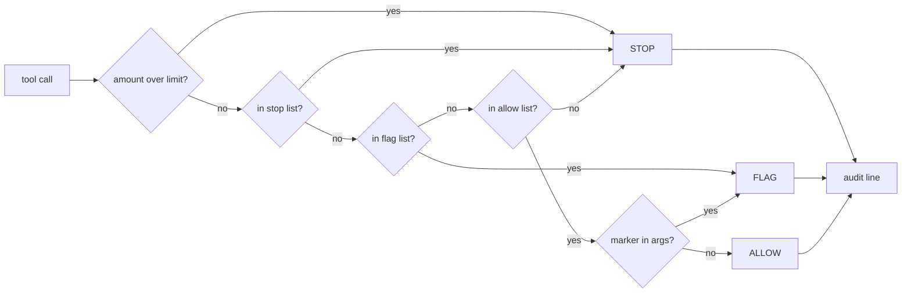

# agent-spend-guard

**Approval gates and an audit trail for agent tool calls. Refuses by default.**


Your agent has a list of tools. Nothing sits between "the model decided to call
`make_payment`" and the payment. This puts something there — and anything it
does not recognise is refused, not waved through:

```console
$ spend-guard check make_payment '{"amount": 9}'
STOP   make_payment
        'make_payment' is irreversible or financial

$ spend-guard check make_payment '{"amount": 900}'
STOP   make_payment
        amount 900 exceeds the 25 limit

$ spend-guard check read_file '{"path": "/srv/production/db.conf"}'
FLAG   read_file
        'read_file' is routine but its arguments mention 'production'

$ spend-guard check wire_transfer '{}'
STOP   wire_transfer
        'wire_transfer' is not in the policy — refusing rather than guessing
```

Exit code is `2` for `STOP`, so it composes into shell checks and CI.

## Why this and not a prompt

Telling a model "always ask before spending money" is a request. This is a
conditional that runs before the tool does. The model does not get a vote.

Three tiers:

| Tier | Meaning | Behaviour |
|---|---|---|
| `ALLOW` | routine, reversible | runs, logged |
| `FLAG` | outward-facing or costly | runs, logged, surfaced loudly |
| `STOP` | irreversible, financial, destructive | **refused**, logged |

**An unrecognised tool is `STOP`.** A guard that fails open is not a guard. Add
a tool to your agent and forget to classify it, and it is refused rather than
quietly permitted.

## How it works

Classification is pure and deterministic — no I/O, no clock, no network. Every
decision is a function of the policy and the call, and every decision writes
one audit line:



## Policy

`spend-guard.toml`, discovered from the working directory upward:

```toml
[tools]
allow = ["read_file", "search", "git_diff"]
flag  = ["send_email", "deploy", "write_file"]
stop  = ["make_payment", "delete_data", "rotate_credentials"]

[escalate]
markers = ["production", "customer", "invoice"]

[limits]
spend = 25.0
```

Two escalation rules beyond the tool lists:

- **Argument markers.** A routine call whose arguments mention `production`
  gets upgraded to `FLAG`. Reading a file is fine; reading a production file
  is worth seeing.
- **Spend ceiling.** Any call carrying an amount above `limits.spend` becomes
  `STOP` regardless of its tool tier, because a "routine" call that moves real
  money is not routine.

`spend-guard explain` prints the active policy without running anything:

```console
$ spend-guard explain
allow (6): git_diff, git_status, list_files, read_file, run_tests, search
flag  (5): deploy, open_pull_request, post_message, send_email, write_file
stop  (5): delete_data, make_payment, rotate_credentials, sign_contract, teardown_infra
escalate markers: production, prod-, customer, invoice
spend limit: 25.0

Anything not listed above is refused.
```

## The audit trail

Every decision appends one JSON line — including the refusals, which are the
ones you most need afterwards:

```json
{"phase": "intent", "tool": "make_payment", "tier": "stop",
 "reason": "amount 900 exceeds the 25 limit", "matched": "spend_limit:25",
 "args": {"amount": 900, "api_key": "***redacted***"},
 "ts": "2026-07-21T08:00:00+00:00"}
```

Redaction is **key-based, not value-based**: anything under a key containing
`token`, `password`, `secret`, `key`, `credential`, `authorization`, `cookie`
or `session` is replaced, whatever it holds. Nested dicts and lists included.
A log that leaks credentials is a liability, not a record.

## Quick start

Not on PyPI yet — install from a clone:

```console
git clone https://github.com/bgorzelic/agent-spend-guard.git
cd agent-spend-guard
pip install .          # or: uv pip install -e .
spend-guard explain    # uses the spend-guard.toml in this repo
```

Python 3.11+. **No dependencies** — it sits in the path of every tool call, so
it brings nothing with it. Tests: `pytest` (31 tests).

## Integrating

`Guard.check()` is the entire surface. Call it before dispatch and honour the
result:

```python
from spend_guard import Guard, load

guard = Guard(load("spend-guard.toml"), log_path="var/audit.jsonl")

decision = guard.check(tool_name, tool_args)
if decision.blocked:
    return {"status": "blocked", "reason": decision.reason}

result = run_tool(tool_name, tool_args)
guard.record_result(tool_name, decision, result)
```

Framework-agnostic on purpose. Adapters wrap this; it does not wrap them.

## Status

`0.1.0` — the core (policy, classification, guard, CLI, redaction) is built and
tested. No framework adapters ship yet, and the package is not published to
PyPI.

## License

MIT
